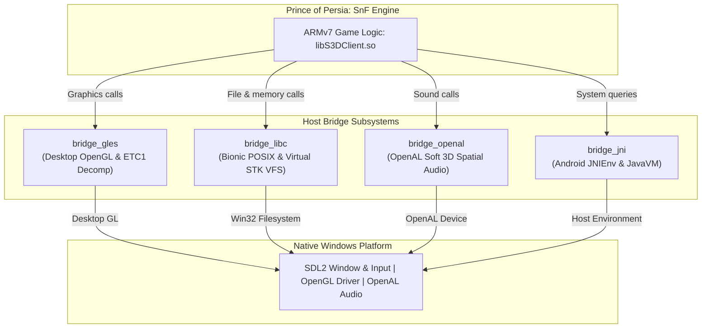

# Prince of Persia: The Shadow and the Flame - Native PC Port

An authentic, native Windows x64 PC port of **Prince of Persia: The Shadow and the Flame** (ShiVa3D engine Android/iOS remake), running natively via Dynarmic ARMv7 JIT dynamic binary retranslation, Desktop OpenGL, OpenAL, and SDL2.

---

## Overview

Unlike running the game in heavy Android emulators (BlueStacks, Nox, LDPlayer) that virtualize an entire Android OS and kernel, this project runs the original ARMv7 shared library (`libS3DClient.so`) **natively** as a standard 64-bit Windows executable:

- **CPU Retranslation**: Retranslates ARMv7 machine code directly into host x86-64 machine code in real-time using a precompiled, self-contained [Dynarmic](https://github.com/merryhime/dynarmic) static fat library.
- **Graphics Translation**: Bridges Android OpenGL ES 2.0 API calls to Desktop OpenGL compatibility profile, with on-the-fly software ETC1 decompression for Android compressed textures.
- **Audio**: Bridges OpenSL ES / OpenAL audio calls to modern 64-bit OpenAL Soft.
- **System Emulation**: Ultra-lightweight Bionic libc, POSIX filesystem, and Android JNIEnv/JavaVM simulation layer directly in user space.
- **Display & Controls**: Powered by SDL2 with full support for resizable windows, VSync, keyboard input, and XInput/DirectInput gamepad controllers.

---

## Architecture



### Guest Address Space Map (512 MB total):
- `0x00000000 - 0x0000FFFF`: Low memory scratch & argument buffers
- `0x00010000 - 0x0001FFFF`: SVC Trampoline vectors (`0xEF000000 | idx` $\rightarrow$ `BX LR`)
- `0x00020000 - 0x0002FFFF`: Data imports (`__stack_chk_guard`, `_ctype_`, `__sF`, `stdout`, `stderr`)
- `0x00030000 - 0x0003FFFF`: JNIEnv & JavaVM structures (`FAKE_ENV_ADDR`, `FAKE_VM_ADDR`)
- `0x01000000 - 0x01BD0B6C`: `libS3DClient.so` ELF image (code & static data)
- `0x02000000 - 0x1E000000`: Dynamic 28-bin segregated free-list heap (448 MB capacity)
- `0x1E000000 - 0x1FFFFFE0`: Downward-growing guest ARM stack & guard arena (32 MB)

---

## Launcher & Configurator (`PoPSnF_Launcher.exe`)

The port includes a dedicated, nostalgic configuration utility inspired by the launchers of the older Prince of Persia titles:

- **1-Click APK Asset Extractor**: Drop your original Android `.apk` file into the launcher to extract `libS3DClient.so`, `S3DMain.stk`, and the Android Ubisoft startup splash in under 1 second.
- **Graphics Options**:
  - Native 16:9 widescreen resolutions from 720p up to **4K UHD (3840x2160)**.
  - Borderless Fullscreen and Vertical Sync (**VSync**) to eliminate screen tearing.
  - Configurable **Frame Rate Limiter** (30, 60 FPS recommended, 120, 144, 165, 240, or Unlimited).
  - Multi-Sample Anti-Aliasing (**MSAA**) up to 8x.
  - High-precision **Anisotropic Filtering** up to 16x.
- **Advanced Controls Remapper**:
  - **Full Mouse Support**: Map any action to mouse buttons (`Mouse Left`, `Mouse Right`, `Mouse Middle`, `Mouse 4`, `Mouse 5`) or mouse scroll wheel (`Wheel Up`, `Wheel Down`, `Wheel Left`, `Wheel Right`).
  - **Conflict Swapping**: When remapping a key already in use, the old and new bindings swap automatically without duplicates.
  - **Dolphin-Style Escape Key Binding**: Hold `Escape` for 750ms or double-tap to bind Escape itself; tap quickly to cancel.
  - **Undo / Redo History**: Revert or reapply key reassignments at any time (`Ctrl+Z`, `Ctrl+Y`, and on-screen buttons).

---

## Controls (Default Mappings)

All bindings can be customized in the Launcher or via `game/config.ini`:

| In-Game Action | Primary Key | Secondary Key | Gamepad (Controller) |
| :--- | :--- | :--- | :--- |
| **Move Up / Climb / Menu Up** | `W` | `Up Arrow` | D-Pad Up / Left Stick Up |
| **Move Down / Crouch / Menu Down** | `S` | `Down Arrow` | D-Pad Down / Left Stick Down |
| **Move Left / Menu Left** | `A` | `Left Arrow` | D-Pad Left / Left Stick Left |
| **Move Right / Menu Right** | `D` | `Right Arrow` | D-Pad Right / Left Stick Right |
| **Sword Attack** | `L` | *(Unassigned)* | Button `X / Square` |
| **Jump / Stand Jump / Forward Slash** | `J` | `Space` | Button `A / Cross` |
| **Roll / Menu Interact / Up Slash** | `Return (Enter)` | `Left Shift` | Button `B / Circle` |
| **Stealth Walk / Block in Combat** | `Q` | *(Unassigned)* | Left Shoulder (`LB / L1`) |
| **Use Healing Potion** | `E` | *(Unassigned)* | Right Shoulder (`RB / R1`) |
| **Back / Cancel** | `Escape` | *(Unassigned)* | `Back / Select` |
| **Pause Game** | `P` | *(Unassigned)* | `Start / Menu` |

Mouse movement and left-click are also mapped to touch events for intuitive menu navigation and store interactions.

---

## Building from Source

All necessary build tools (GCC 16.2.0 w64devkit and CMake 4.4.2) are to be placed directly in the repository under `tools/`. Third-party dependencies (SDL2, OpenAL Soft, Dear ImGui, miniz, and Dynarmic) are precompiled and vendored under `third_party/`.

### 1. Build using Helper Scripts (Recommended)

#### Production Build (Default):
Lean, zero-overhead, silent execution with no extra background threads, no pipe hijacking, and no disk logging overhead:
```cmd
.\build.bat
```
*Or in PowerShell:*
```powershell
.\build.ps1
```

#### Debug Build:
Enables full runtime telemetry, sliding-window performance profiler (`logs/perf.log`), call-site memory leak tracking, unhandled libc/JNI tracing, and the freeze watchdog thread:
```cmd
.\build.bat --debug
```
*Or in PowerShell:*
```powershell
.\build.ps1 -debug
```

### 2. Manual CMake Configuration (Optional):
```powershell
$env:PATH = "$PWD\tools\w64devkit\bin;$PWD\tools\cmake\bin;" + $env:PATH

# Production build (default):
cmake -B build_app -G Ninja -DCMAKE_BUILD_TYPE=Release -DENABLE_DEBUG=OFF
cmake --build build_app

# Or Debug build:
cmake -B build_app -G Ninja -DCMAKE_BUILD_TYPE=Debug -DENABLE_DEBUG=ON
cmake --build build_app
```
*CMake compiles both `PoPSnF_PC.exe` and `PoPSnF_Launcher.exe`, links against vendored libraries, and auto-deploys them alongside `SDL2.dll` and `OpenAL32.dll` directly into `game/`.*

---

## Running the Game

### Recommended: Launch via Configurator
```powershell
.\game\PoPSnF_Launcher.exe
```
If you haven't extracted your assets yet, the launcher will prompt you to select your `.apk` file and automatically unpack everything you need in less than a second.

### Direct Execution:
```powershell
# Standard production run (clean, silent, high-performance):
.\game\PoPSnF_PC.exe

# Or enable runtime debug diagnostics & telemetry on demand:
.\game\PoPSnF_PC.exe --debug
```

In production mode, the game runs silently with zero logging overhead. When `--debug` is specified (or when compiled in Debug mode), telemetry, per-second frame diagnostics, and profiler logs display in your console and write to `logs/pop_pc_*.log` and `logs/perf.log`. Framebuffer captures can be taken at any time with `F12` and are saved to `screenshots/`.

---

## 📂 Project Structure

For a full directory index and maintenance instructions (including how to regenerate precompiled dependencies), see [WORKSPACE_GUIDE.md](WORKSPACE_GUIDE.md) and [SETUP.md](SETUP.md).

---

## Credits & License

This project's source code and custom tooling are licensed under the **GNU General Public License v3.0** (GPL-3.0). See [LICENSE](LICENSE) for the full license text.

### Legal Notice & Non-Affiliation Disclaimer
- **Prince of Persia** and **Prince of Persia: The Shadow and the Flame** are registered trademarks of Ubisoft Entertainment and Jordan Mechner.
- This project is an unofficial, non-commercial open-source fan preservation and compatibility layer created for educational, research, and archival purposes. It is not affiliated with, endorsed by, sponsored by, or supported by Ubisoft Entertainment or Jordan Mechner.
- **No copyrighted game assets** (models, textures, audio, level data, or proprietary game binaries) are distributed in this repository. Users must supply their own legally acquired copy of the game.

### Acknowledgments & Dependencies
- **Dynarmic**: Fast ARMv7 dynamic recompiler by merryhime and contributors (0BSD).
- **Dear ImGui**: Immediate-mode GUI library by Omar Cornut and contributors (MIT).
- **SDL2**: Cross-platform window, audio, and input handling (zlib).
- **OpenAL Soft**: 3D spatial software audio synthesizer (LGPL v2+).
- **miniz & LZMA**: High-performance zip and lzma decompression libraries.
- **pop2-vita**: PS Vita wrapper reference and research by usineur.
