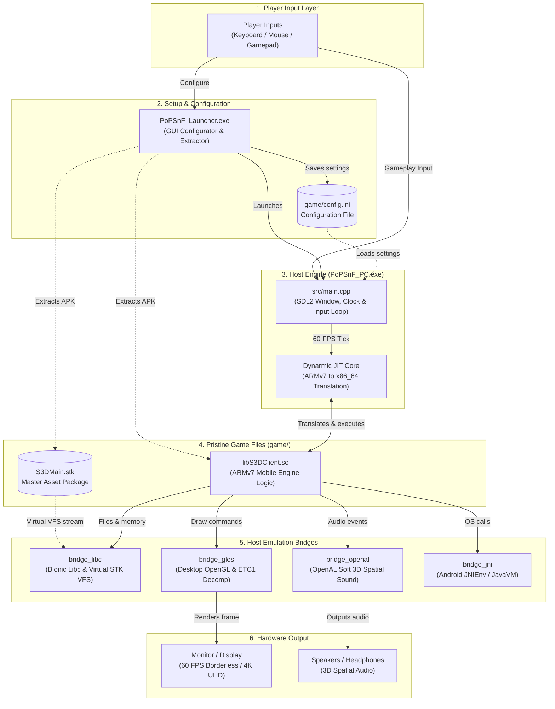
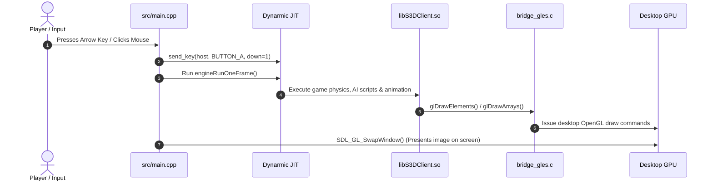

# Prince of Persia: SnF PC Port - Source Code & Architecture Guide

> **Target Audience**: Anyone curious about how this PC port works - whether you are an experienced software engineer, a speedrunner, or someone who has **never written or seen a line of C or C++ in your life**.

---

## Table of Contents
1. [The Big Picture: How Does a Mobile Game Run on PC Without Source Code?](#1-the-big-picture)
2. [The Core Dilemma: Aliens and Translators](#2-the-core-dilemma)
3. [The High-Level Architecture](#3-the-high-level-architecture)
4. [The 6 Pillars of the Engine](#4-the-6-pillars-of-the-engine)
5. [The Life of a Single Game Frame](#5-the-life-of-a-single-game-frame)
6. [File-by-File Breakdown](#6-file-by-file-breakdown)
   - [`src/main.cpp` - The Conductor](#srcmaincpp--the-conductor)
   - [`src/build_version.h` - The Version Badge](#srcbuild_versionh--the-version-badge)
   - [`src/elf32/elf32_loader.c` & `.h` - The Cartridge Loader](#srcelf32--the-cartridge-loader)
   - [`src/runtime/dynarmic_host.cpp` & `.h` - The CPU Translator](#srcruntime--the-cpu-translator)
   - [`src/bridge/bridge_libc.c` & `.h` - The Operating System Diplomat](#srcbridgebridge_libcc--the-operating-system-diplomat)
   - [`src/bridge/bridge_gles.c` & `.h` - The Graphics Artist](#srcbridgebridge_glesc--the-graphics-artist)
   - [`src/bridge/bridge_openal.c` & `.h` - The Sound Engineer](#srcbridgebridge_openalc--the-sound-engineer)
   - [`src/bridge/bridge_jni.c` & `.h` - The Android Phone Impersonator](#srcbridgebridge_jnic--the-android-phone-impersonator)
   - [`src/bridge/hud_back_btn_dxt5.h` - The Texture Surgeon](#srcbridgehud_back_btn_dxt5h--the-texture-surgeon)
   - [`CMakeLists.txt` - The Construction Recipe](#cmakeliststxt--the-construction-recipe)
7. [Glossary of Technical Terms Made Simple](#7-glossary-of-technical-terms-made-simple)

---

## 1. The Big Picture

In 2013, Ubisoft released ***Prince of Persia: The Shadow and the Flame*** for Android and iOS smartphones. It was built using a 3D game engine called **ShiVa3D**. The game never received an official PC release.

Normally, when a game company ports a game from phone to PC, they open up the original human-readable source code (millions of lines of C++ text files), reconfigure the project in Visual Studio on Windows, click "Compile", and fix any bugs.

**We do not have Ubisoft's original source code.**
All we have is the published Android game file: a file called `libS3DClient.so` extracted from an Android phone.

This project is a **native dynamic binary translation port**. Rather than running a heavyweight Android emulator (which boots an entire Android operating system inside a virtual machine and runs sluggishly), our project loads the game's compiled mobile code **directly into Windows memory**, translates its phone instructions to PC instructions at blinding speed, and fools the game into believing it is running on a high-end Android phone while sending all graphics, sound, and controls directly to Windows, DirectX/OpenGL, and your graphics card.

---

## 2. The Core Dilemma: Aliens and Translators

To understand why this codebase exists, imagine two people:
1. **The Game (`libS3DClient.so`)**: A French chef who only knows how to speak French, only knows how to cook in a French mobile kitchen, and expects French suppliers.
2. **Your Computer (Windows x64 PC)**: An English landlord who only understands English instructions, has an American electric kitchen, and uses English plumbing.

If you throw the French chef into the English house with no preparation:
- The chef speaks ARM machine code. Your CPU only understands x86_64 machine code. **Total incomprehension (Crash #1).**
- The chef shouts: *"Where is the Android Java Virtual Machine?"* Windows says: *"I have no idea what that is."* **Crash #2.**
- The chef asks for Android Linux memory allocation (`/dev/ashmem` or Bionic libc). Windows has Windows Heap (`VirtualAlloc`). **Crash #3.**
- The chef draws using OpenGL ES 2.0 with mobile compressed textures (ETC1). Your desktop graphics card uses Desktop OpenGL with desktop textures (DXT/BC). **Black screen (Crash #4).**
- The chef makes sound using OpenSL ES or Android AudioTrack. Windows uses WASAPI or DirectSound. **Silence (Crash #5).**

### Our Solution: The Spy and Bridge Network
Our C/C++ program acts as a **complete undercover bridge network**:
- Whenever the game tries to run ARM code, our JIT compiler (`Dynarmic`) instantly translates it into PC machine code.
- Whenever the game asks for an Android service, our code steps in, impersonates Android, gives the exact expected answer, and translates the request into a native Windows command.

The game thinks it is running on the fastest Android phone on Earth!

---

## 3. The High-Level Architecture

Here is how data flows through the entire system:

---

## 4. The 7 Pillars of the Engine

### Pillar 1: Dynamic Binary Translation (Dynarmic JIT)
Smartphones use **ARM CPUs** (RISC architecture: 32-bit registers, simple instructions).
PCs use **x86_64 CPUs** (CISC architecture: 64-bit complex instructions).
Instead of interpreting ARM instructions one by one, we use **Dynarmic**, a Just-In-Time (JIT) compiler. Dynarmic translates blocks of ARM code directly into equivalent x86_64 machine code at native execution speed. Dynarmic is linked as a precompiled static fat library (`libdynarmic.a`) that encapsulates the ARM32 translation core and internal dependencies without needing Boost sources in the tree.

### Pillar 2: The Binary Loader (ELF32)
Mobile game libraries are packaged as `.so` files (Shared Objects in Linux ELF format). Windows only knows how to load `.dll` files (PE format). Our custom **ELF loader** (`src/elf32/`) parses the sections of `libS3DClient.so`, copies them to memory address `0x01000000`, performs ARM dynamic relocations, and binds external symbol imports to our C bridge functions.

### Pillar 3: The C Standard Library Bridge (`bridge_libc`)
Every C program relies on basic helper functions (`malloc`, `free`, `fopen`, `printf`). On Android, these belong to Google's Bionic C library:
- **Segregated Heap Allocator**: 2-gigabyte heap with 28 separate size bins ensuring the game never fragments or runs out of RAM.
- **POSIX Directory Traversal (`scandir` & `alphasort`)**: Implements Bionic directory scanning (`/system/fonts`, `./Cache`), allocating guest 280-byte `dirent` structs, sorting filenames via `alphasort` (`strcoll`), and delivering guest pointer arrays.
- **Render Queue `qsort` Comparators**: Intercepts guest comparison function pointers (`render_cmp_5e8a1c` for player render priority, `render_cmp_797d38` for distance-sorted mesh subsets) so sorting executes safely in host C.

### Pillar 4: The Graphics Bridge (`bridge_gles`)
Smartphones use **OpenGL ES 2.0**. PCs use **Desktop OpenGL or DirectX**:
- Phones use **ETC1 compressed textures** to save memory. Our bridge includes a software decompression algorithm converting ETC1 blocks into 32-bit RGBA pixels in memory on the fly.
- Mobile shaders use GLSL ES 1.00 (`precision mediump float;`). Our bridge automatically translates shaders to Desktop GLSL 1.20 during compilation.

### Pillar 5: The Audio Bridge (`bridge_openal`)
Phones send sound through Android audio streams. We redirect sound buffer uploads and 3D positioning calls to **OpenAL Soft**, providing 3D spatial surround sound and pitch-perfect music playback.

### Pillar 6: The Virtual STK File System
When ShiVa3D loads models and textures, it opens `S3DMain.stk` thousands of times without closing them. Opening 2,048 files exhausts the Windows file limit and crashes the game. Our **Virtual STK File System** opens the physical archive file once and assigns virtual file descriptors, tracking offsets internally to prevent leaked Windows handles. Furthermore, our VFS allows the entire game to run **100% STK-only**, eliminating the need for thousands of loose files on disk.

### Pillar 7: The Unified Configuration & Launcher Ecosystem
A native PC port needs modern graphics controls and flexible key rebinding without requiring players to edit raw text files. The standalone **PoPSnF_Launcher** provides:
- **Instant Asset Provisioning**: Extracts `libS3DClient.so`, `S3DMain.stk`, and the Android activity's `app_splash.png` directly from any standard Android `.apk` file using `miniz` in under a second. The splash is a host-side startup resource, not an STK asset.
- **Display & Quality Configuration**: Grants full control over widescreen resolutions (up to 4K UHD), borderless fullscreen, 60 FPS VSync, MSAA antialiasing (up to 8x), and anisotropic filtering (up to 16x).
- **Intelligent Input Remapping**:
  - **Conflict Swapping**: Automatically swaps keys when rebinding conflicting actions.
  - **Scroll Wheel Input**: Binds mouse scroll wheel ticks (`Wheel Up`, `Wheel Down`, etc.) with game-side 3-frame pulse generation.
  - **Dolphin-Style Escape Key Binding**: Supports binding the `Escape` key itself via hold-to-bind ($\ge 750\text{ ms}$) or double-tap, while a quick tap cancels.
  - **Undo / Redo History**: Reverts or reapplies changes with `Ctrl+Z`, `Ctrl+Y`, and on-screen controls.

---

## 5. The Life of a Single Game Frame

---

## 6. File-by-File Breakdown

### `src/main.cpp` - The Conductor
1. Loads user display and control configurations from `game/config.ini`.
2. Configures the asynchronous Windows anonymous pipe tee logger (`setup_dual_logging`, `log_tee_thread`), piping console output to `game/pop_pc.log` and `game/logs/`.
3. Creates the borderless fullscreen or windowed screen using SDL2 with requested MSAA and VSync attributes.
4. Resolves the game directory path to `game/` and sets working directory isolation.
5. Allocates a 3GB memory sandbox for guest execution.
6. Directs the ELF loader to map `libS3DClient.so`.
7. Applies gameplay, camera, and HUD Z-order patches.
8. Manages the ShiVa3D AI `StringPool` (expanded to 16MB) and resets the allocation cursor every frame.
9. Handles input routing: maps keyboard, mouse buttons, and gamepad inputs to virtual Android keycodes; processes mouse motion via `S3DClient_iPhone_OnMouseMoved` for clean desktop hover and single-click interaction without sticky touch states; and manages the 3-frame mouse scroll wheel pulse queue.
10. Executes the 60 FPS master loop: polls inputs, executes one frame, issues draw commands, and presents the frame.

### `src/build_version.h` - The Version Badge
Defines build tracking constants:
- `BUILD_NUMBER`: Integer incremented with major updates.
- `BUILD_TAG`: Version string stamped on diagnostic logs and screenshots.

### `src/config.h` & `src/config.cpp` - The Master Configurator
Manages the `GameConfig` state, reads/writes standard `config.ini` files, formats scancode names, parses friendly bind aliases, and abstracts keyboard, gamepad, and mouse codes (including `MOUSE_BIND_LMB`..`MOUSE_BIND_WHEEL_RIGHT`).

### `src/launcher/launcher_main.cpp` - The Nostalgic Gateway
Implements the Prince of Persia (2008) styled launcher using Dear ImGui, SDL2, and OpenGL 2.0. Hosts the tabbed Graphics & Controls dialogs, conflict swapping logic, Dolphin-style Escape key handling, and the 50-step Undo/Redo history stack.

### `src/launcher/extractor.h` & `extractor.cpp` - The High-Speed Asset Extractor
Fast, streaming ZIP package extractor powered by `miniz`. Directly reads any standard Android `.apk` archive and writes `libS3DClient.so`, `S3DMain.stk`, and the Android activity's `app_splash.png` into the game directory in under one second.

### `src/launcher/embedded_assets.h` & `embedded_assets.cpp` - The Self-Contained Vault
Contains pre-converted binary byte arrays of the official hero wallpaper and franchise logo, ensuring the launcher renders its nostalgic aesthetic out of the box without requiring external loose image files.

### `src/elf32/` - The Cartridge Loader
* Files: `elf32_loader.c`, `elf32_loader.h`
Reads ELF headers, loads segments into memory at `0x01000000`, and binds unresolved symbol relocations to our bridge implementations.

### `src/runtime/` - The CPU Translator
* Files: `dynarmic_host.cpp`, `dynarmic_host.h`
Configures the **Dynarmic ARMv7 JIT recompiler**, registers memory pages, dispatches SVC calls to host C functions, and marshals register state. Links cleanly against `third_party/dynarmic/lib/windows-x64/libdynarmic.a` without external source trees.

### `src/bridge/bridge_libc.c` - The Operating System Diplomat
* Files: `bridge_libc.c`, `bridge_libc.h`
Implements the 3GB guest heap allocator with Knuth boundary-tag bidirectional coalescing, O(1) doubly-linked free bins, and top-of-heap bump rollback (preventing OOM memory explosions during extended gameplay). Also manages POSIX path sanitization, case-insensitive asset resolution and `.etc` texture fallbacks, `scandir`/`alphasort` directory traversal, hardened `qsort` comparators, and the Virtual STK file handle system.

### `src/bridge/bridge_gles.c` - The Graphics Artist
* Files: `bridge_gles.c`, `bridge_gles.h`
Forwards OpenGL ES 2.0 calls to Desktop OpenGL, performs software ETC1 decompression, converts mobile shaders to GLSL 1.20, injects store back-button graphics, and handles framebuffer captures.

### `src/bridge/bridge_openal.c` - The Sound Engineer
* Files: `bridge_openal.c`, `bridge_openal.h`
Connects audio streams and positional 3D sound effects to OpenAL Soft, managing sound buffers and music playback.

### `src/bridge/bridge_jni.c` - The Android Phone Impersonator
* Files: `bridge_jni.c`, `bridge_jni.h`
Impersonates Android JavaVM/JNIEnv with 160+ protected function pointer slots, answers system capability queries, and handles platform callbacks.

### `src/bridge/hud_back_btn_dxt5.h` - The Texture Surgeon
Contains 27,216 bytes of pre-compressed DXT5 texture data restoring the red curved back button on menu screens.

### `CMakeLists.txt` - The Construction Recipe
Configures C++20 compiler flags, defines include search directories, links `libdynarmic.a`, SDL2, OpenAL, OpenGL, and ImGui, compiles both `PoPSnF_PC.exe` and `PoPSnF_Launcher.exe`, and auto-deploys runtime binaries and libraries into `game/` post-build.

---

## 7. Glossary of Technical Terms Made Simple

| Term | What It Actually Means |
| :--- | :--- |
| **ARMv7** | 32-bit RISC processor instruction set used by smartphones. |
| **x86_64 / AMD64** | 64-bit CISC instruction set used by modern desktop PCs. |
| **JIT (Just-In-Time)** | Translating code dynamically while the game executes. |
| **Fat Library** | A single merged archive bundling multiple static libraries together. |
| **ELF (.so)** | Executable and Linkable Format used for shared libraries on Android/Linux. |
| **PE (.exe / .dll)**| Portable Executable format used on Windows. |
| **JNI** | Java Native Interface - the API bridging Java and native C/C++ on Android. |
| **SVC** | Supervisor Call instruction triggering guest-to-host system requests. |
| **Relocation** | Rewriting memory pointers in executable code at load time. |
| **Bionic** | Google's minimal C standard library designed for Android. |
| **ETC1** | Ericsson Texture Compression format used by mobile GPUs. |
| **DXT / BC** | Desktop DirectX Texture Compression formats. |
| **OpenAL** | Open Audio Library - a cross-platform 3D audio API. |
| **STK / SMF** | ShiVa3D engine encrypted asset archive format. |
